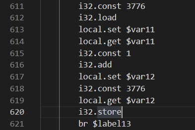

<style>
img {
    max-height: 30em;
    max-width: 80%;
    box-shadow: 0 1px 0.5em rgba(0, 0, 0, .25);
}
body {
    background-color: #f3f3f3;
}
#write {
    max-width: 900px !important;
    box-shadow: 0 0 2em rgba(0, 0, 0, .15);
    background-color: white;
}
#write p {
    margin: 1em 0;
}
</style>

# ranwen's Writeups

非常荣幸能在这次比赛参与命题和平台维护工作。由于一开始我对各位参赛选手热情的错误估计，我这次出题宗旨就两个字："放水"。看最终结果我这个水放的确实够多了。

本人在此次比赛中共出了四道题，分别为：2038 年的银行、人类行为研究实验、未来的机器、安全的密钥交换。正好涵盖了四个方向（雾）。本文含有这四道题的详细题解，以及一道我参与验题的题目（千年讲堂的方形轮子）的简要题解。


## 2038 年的银行

经典有手就能玩！似乎还有不少人过了这道题没却签到的。

进入页面后，简单计算一下，发现只通过存钱是必赚不到钱的。考虑题目中的"2038"暗示了整数溢出，因此考虑构造溢出。

> 容易观察，这题并不是 USTC Hackergame 的狗狗银行，从存款到贷款，利息全部使用的向下舍入。
>
> 不过当银行个数大于3个的时候，可以在每一个银行贷款19元，全部存到一个银行来达到靠存款借钱的目的。

根据题目描述，简单试验一下，发现可以通过银行间倒钱的方法来提高借款额度（最高上限为2000000000）。具体的，将钱存在一个银行里头，并借款最大额度。之后把所有的钱存入另一家银行，以获得更大的额度。利用此方法，在两家银行间来回倒即可。

利用此方法，将借款额度提高到最大。之后在某一家银行借款，并不断通过买面包进入下一天的方式使欠款额溢出。简单操作发现，溢出后，若仍进入下一天，则欠款额会在 +INT_MAX和-INT_MAX间反复横跳。此时如果我们将贷出来的20亿分开存到银行里，那么存款利息就会稳步上升，而欠款相对稳定。等到总金额大于flag金额的时候，便可以分开将贷款还完，之后购买flag。

> 细心的同学可以发现，这道题的int32其实是假的。本题的int32是大力用python模拟出来的（手动处理补码）。具体的，python在处理负数整除正数的时候，采用的是向下（负无穷）舍入，而常规的方法是向0舍入。这会使本题处理出来的数字会比直接写C处理出来的要相差1。

信息安全是一个很广泛的概念。从业务逻辑到程序设计，均可成为攻击的方向。同时，因整型溢出而影响业务逻辑也是很常见的，应当重视其可能带来的后果。

## 人类行为研究实验

经典有手就能玩！

该题最初是由两道题合并而来。我负责了原题的一部分，以及合并时适配。

关于套一层HTTP代理：

主要目的是让大家意识到采用公共HTTP代理可能会带来的风险。不知道有多少人被那个"百京大学"的logo逗乐了，不知道多少人真的被那个假IAAA唬住了（以及有多少人的浏览器会自动填充密码）。设置代理本身很简单，随意上网搜索即可。

以下wp分为两部分，分别针对两个任务的解法。

### 完成实验

#### 解法一

老老实实完成任务。~~经典有手就能玩！~~

具体地，这对应一个数学上的问题。每次前37%无脑点跳过，之后如果在后边遇到比前37%都要大的数就选择停止。这有约37%的概率获得最大值。可以搜索"最优停止理论"得到相关证明，也可参考[单身狗速进！如何科学有效地脱单？_哔哩哔哩 (゜-゜)つロ 干杯~-bilibili](https://www.bilibili.com/video/BV1uJ411D7AW)。

当然，这个做法在本题其实不是最优的。具体的：最优停止理论是在仅能进行比较的情况下适用的理论。该题中，数字是是有界的（多开几把观察以下或者翻源码均可发现）。而这种情况下，该理论并不是最优的。~~严格最优的我也不会，我个人感觉策略不是简单的。~~事实上，可以简单地估测一下数字范围，之后写一个算法计算"后边所有数字都比自己小"的概率，若大于0.5就选择，则可以取得约50%的胜率。

完成游戏后，会自动弹出第一个flag，同时有一个"上传成绩"的按钮，对应第二个flag的页面。

#### 解法二

当然是直接看代码。

点开网页源代码，发现核心部分都在maximum.js中。这份代码是被minify过的，随便找个格式化工具即可。

仔细审计源代码~~（搜索"flag"字符串）~~，发现获取flag部分在get(won)函数中。简单阅读一下，发现具体地flag是在请求一个target变量的URL。直接把相关语句复制到浏览器审查元素的console中，可直接进行计算得到结果"/flag?k=cyclononane"。从这个结果我们可以感受到：Javascript is awesome!。注意需要在该URL后补上token。之后手动访问URL即可得到第一个flag。

再次审计源码，发现在点击"上传成绩"的时候会调用submit函数，具体地，会跳转到"http://iaaa.pku.edu.cn/"，进入第二个flag的界面。

### 上传成绩

该任务造了一个假的IAAA界面。随便输入学号密码后，发现无论输入什么，都会跳转到游戏界面的"/callback?jwt=X&token=T"，而页面要求你的身份应为teacher。因此猜测，这题的考点主要是这个"jwt"参数。

搜索jwt，发现其是一种安全传输信息的方式，同时可得到一个网站 jwt.io ，提供了jwt的解码和签名认证。

将jwt后的参数复制进去，发现其数据正好为{"identity":"student"}，显然，需要我们把这个"student"替换为"teacher"。

剩下的就是jwt的签名部分了。通过题面描述"他没有研究并设置任何的可配置参数"可猜测，他没有设置secret。当然，此处可以随便搜索一个jwt-secret爆破程序，得到secret为空。直接在jwt.io中将secret修改为空，把结果复制下来，替换到callback页面的jwt参数，即可拿到flag。

> 当然，这题使用HTTP代理然后让选手访问假IAAA的操作确实是存在一定安全问题的。我本人在出题前已经通过修改源代码，检查各类设置以及真IAAA的一些参数来避免产生安全问题。当然，对于发现我前端不会传输密码进而手动修改请求，加入密码的同学，我也无能为力了。

## 未来的机器

经典有手也不一定能玩！

本题有多种解法，有些方法可能需要一定的观察与运气。当然，大部分解法都要理解本题的汇编语言和模拟器。

我在出题的时候，本意是想出一个逆向，但核心点又不在逆向本身的题，同时我个人很喜欢WASM，于是就有了这道题。真正从头读汇编实际上是最不推荐的做法。

### 关于此汇编语言

有相关经验的同学应该可以很容易发现，这种汇编语言就是最近比较火的 WebAssembly(WASM) 语言。从其名字可以看出，这种语言诞生就是为了让一些更底层的程序跑在浏览器上，解决某些JS难以解决的问题，同时增强程序的可移植性。

当然，即使你没有相关经验，可以直接查到这是WASM。具体地，稍微观察一下文本，里面有一行很特殊: `call $env.abortStackOverflow`，是使用了call的唯一一条语句。将这条语句放在搜索引擎搜索（如果要使用百度就必须加上引号），可以观察到这份代码是由 Emscripten 生成的 WASM 代码。这份代码其实是可以进行反编译的，只不过需要进行少量的工作才能使其直接喂入反编译器。后续有相关解法。

关于模拟器和语言的介绍：

从模拟器代码，或WASM的介绍可以了解到，WASM基于堆栈结构机器(stack machine)的语言。具体地，它没有具体的显式寄存器，而是维护了一个栈，所有的操作都从这个栈内进行临时数据的存储。其同时具有单独的内存memory，可提供按字节的随机访问。还具有一个存储全局变量的global（例如C语言中extern，会将该变量在内存的地址存入global）。拥有一个保存局部变量的local表。

同时，WASM的跳转是基于block的，而不同于常见的x86 ASM的jmp。

只考虑仅在本题出现的语句（不含call）。描述可能并不标准。

- global.get/set: 取值或赋值全局变量，后边的标签即全局变量存取的位置。将获取的值存到栈顶或从栈取出要保存的值。
- local.get/set: 类似上条，但是作用域是局部变量。在本题中基本无差别。
- return: 退出函数。栈顶作为返回值。
- br: 跳转到标签。标签通常为loop的开头或block的结尾。
- loop - end: 定义循环标签。其中loop所在位置为br跳转位置。注意其本身并不提供循环功能，在执行到对应的end后仍会向下执行下一条语句。
- block - end: 定义块标签。其中end所在位置位br跳转位置。
- if - else - end: 条件跳转。从栈顶取出一个变量，如果为真则跳转到if块内；反之跳转到end或else（如存在）。注意这个是真正的块结构，即if块结束后会直接跳转到end而不是继续执行else的内容。
- i32.store: 从栈顶分别取出值和位置，将值作为int32（4bytes）存储到memory对应位置的4个字节。
- i32.load: 从栈顶取出位置，从memory对应位置的4个字节取出数据，并作为int32解析放入栈顶。
- i32.const: 定义int32常量并存入栈顶。
- i32.*: 从栈顶中取出一些元素，做一些运算，并将运算结果存入栈顶。具体操作名、参量数和运算可以参照模拟器中的funcTable变量。

以下开始介绍这题的解法。

### 解法一

阅读部分WASM代码/直接观察，猜测大概流程，后进行暴力破解。该方法是期望做法之一。

具体地，由于模拟器中关注了WASM的return值，可以从asm文件中找到所有return的位置（共5处）。

分析一下逻辑，以648行的为例：


简单观察一下，这一段if内将1存到了var0，又取出存到了var14，之后提取var14的值后return。即return 1。正好对应模拟器中RIGHT逻辑。

再往上看几行逻辑，跳转到这个分支需要`var115==28`。因此全局搜索var115。发现其仅在第574行被设置为了28。


再次分析，发现触发这个分支需要`var109>var110`。再往上观察，发现var110正好是global18地址（4982）在mem中对应的值，即我们在模拟器中置入的密文串长度。结合外层有个循环，我们可以合理猜测这段代码的目的：将输入字符串加密后与置入的密文进行逐字节对比。如果所有的字符都一样，那么就return 1。以下对这块循环的进一步分析可印证此结论。

显然，var109对应mem3776。因此在此循环中跟踪3776的变化。简单搜索一下，发现其仅在第620行被store访问了。



简单分析一下，这段代码实际执行的就是`mem3776+=1`，能印证猜想。以下把mem3776称为i。

再看循环体部分。


这段代码中共两次使用了i。第一次计算了`var5=4*i+1552`，并取var5地址的mem值，到var6。第二次计算了`var8=4*i+global19`，并取var8地址的mem值，到var9。后来判断了var6和var9是否相等：如果不等，则跳出循环并return 0；否则继续循环。再观察以下这两个地址，global19也是我们在模拟器中置入的，为5400。而5400就是模拟器中出现的密文的地址。这完全印证了我们的猜想。

那么之后当然是观察程序退出后，位于`4*i+1552`地址的数组的内容了。给程序喂两个不同的输入，发现这个位置的内容确实是不同的。如果你喂的输入只有一个位置不同，那么这个地址的内容也恰好有一个位置不同，虽然相异的位置并不相同。这让我们猜测这题是一个替换密码后进行了位置的打乱。无论如何，既然输入的一位只和输出的一位相关，那么就可以采用暴力fuzz的方法。具体地，按位枚举这个位置的字符，如果1552地址和5400地址的数组相同个数多了1，那么说明我们刚刚的枚举是正确的。这个方法在出题文件中有提供源码。如果你认为这题是单纯的字母表替换密码，那么就会做错（可查看出题文件的原始cpp源码得到解答）。

当然，这块我们也可以大力使用分支统计（统计不同if被走入的次数）。由于我们提供了模拟器，这个功能很好实现。在每字符位都要枚举一遍字符，如果这个if被走入的次数多了1，那么说明我们找到了密文这个位置所对应的明文位置和值。

### 解法二

手写翻译器。将翻译后的源码喂给gcc优化开满然后编译，之后使用ida分析。该方法是期望方法之一。

两位验题人均采用这个方法，具体可参照xmcp的wp。

该方法主要任务栏在写翻译器上。当然，任务量也不是特别大。

### 解法三

使用WASM组织官方提供的[反编译器](https://github.com/WebAssembly/wabt)。该方法是期望方法之一。

具体流程需要先将本题的文本文件进行少许修改，变为可被解析的WAT，WASM文本格式。之后将WAT转换为WASM，再转回C。

随便找一个WASM观察（可用[wat2wasm demo (webassembly.github.io)](https://webassembly.github.io/wabt/demo/wat2wasm/)中的示例，不过更建议自己写一个简单的代码然后用 Emscripten编译），结合模拟器的具体实现，发现我们需要补充三部分：module头、global变量声明、函数声明。同时调用abortStackOverflow部分可以直接删去。修改后的文件在出题文件中。

之后分别调用wat2wasm，wasm2c，即可得到一份非常丑的C语言代码（行数和原始WASM差不多的逐行翻译）。之后使用传统艺能：编译后开IDA。注意编译时不能链接（或者你手动补充定义使其可以连接），且可能需要复制手动wasm-rt.h来编译。

当然由于wasm2c使用了未经简化的内存模型等原因，编译出来的代码会略长（300多行，长于解法二的100多行）。但是这份代码仍然可读性很高。同时也可以通过观察这份代码来猜测算法，而使用解法一的fuzz方法。

### 解法四

肉眼看WASM，分析出每个part的具体作用。该方法**不**是期望方法之一。

该方法工作量大，但似乎不少选手都使用的这个方法~~，因此我还被某些选手怒斥~~。

在此不做分析了。感兴趣的同学可以自己试试。


> 这题提供的WASM模拟器也同样不是完全的。其只支持部分WASM指令，同时部分指令实现也并不标准。
>
> 例如本模拟器的内存并不是基于字节访问存储的，而是直接大力存的int。本题所有变量都是用的int，因此不会出现差异。
>
> 例如本题的取模，对负数处理也不标准，同时对于比较也是按照unsigned比较的（_s后缀表示使用signed模式）。当然，这些问题在本题都不影响。希望不会有选手是发现了这个差别而以为这题有坑，进而变为肉眼看代码。
>
> 关于 abortStackOverflow 函数，是用于处理爆栈的情况的。观察生成的原始WASM文件也可雪人这一点。本题中可以直接删去，不影响本题的执行。

## 安全的密钥交换

~~经典有电脑就能玩！~~纯粹的读代码题（某位选手的评价）!

出这题的目的也仍是送分。题目中的密钥交换算法就是Diffie-Hellman密钥交换算法。值得注意的是，该算法只能防窃听，并不能防中间人攻击。本题就是对这个算法进行简单的中间人攻击。DH密钥交换在现实场景中使用时，一方会先发送自己的证书，并用证书发送自己签名后的随机数。该方法是相对安全的。

关于本题如何进行中间人攻击（主要针对flag2）：

研究一下算法，发现此算法完全没有身份验证的部分。即：我可以通过向A假装我是B，向B假装我是A，进而套取双方的信息。那么中间人攻击的方法就很显然了：自己生成一个随机数作为DH算法的指数，将幂的结果分别发送给AB，之后利用AB传的信息再次计算，得到公共密钥。有公共密钥后，就可以简单的解密cert和flag了。

注意一下，flag1要求最终协商的key小于2**512，那么我将本地生成的随机指数钦定成0就可以保证最终协商的key一定是1了（当然也可以直接发送0，进而key都是0）。

具体实现可以通过修改server代码实现，也可以手动交互。

关于flag2的设置：在密码学中，一个很重要的问题是，如何保证对方发送的数据是可信的（对方的随机数据有没有可能是有陷门的），这也是子任务"安全的密钥"名字来源。在出完这题flag2后，我才意识到这种情况，因此添加了flag1。

细心的同学已经发现了代码中有一处保证了双方生成的指数一定是偶数。这是为了避免当指数为奇数时，直接向双方发送-1，进而可以得到key一定是-1。通过flag1的方法获得了flag2。这题的P也保证了(P-1)/2一定是质数，因此避免了向双方发送k次剩余的方法而有概率获得flag2。当然，我个人感觉想到这一点应该比做出这一题要难。

> 这题在最后查看选手wp的时候才发现，我的cert_verify写假了。具体地，该函数返回了验证结果的正确与否，但外部server并没有验证这个cert是否正确。因此这个part完全可以混掉（但必须要发送一个aes可以正确解密的串）。

## 千年讲堂的方形轮子

~~经典有搜索引擎和脑子就能玩！~~

详情可以参考xmcp的wp。

第一题CBC是常规的 Padding Oracle Attack。具体方法可以上网搜索，有不少讲解的文章。直接搜索"aes cbc 漏洞"、"aes cbc attack"等词就可以直接找到相关介绍（用某度的可能需要多翻几页）。我本人手动写了一个脚本来完成这个任务。

```python
import requests
import json
import time
import re
#from Crypto.Cipher import AES
from base64 import b64decode,b64encode

def xorbyte(a,b):
    assert len(a)==len(b)
    return bytes([a[i]^b[i] for i in range(len(b))])

#ptx="w7U+6e2kDDM8/cmZGuMWT3duMJKJsuA4YGJG07eg5B9soGR8ZlAnn2CZKkGv66JVf8ROqBy1vFw7PLtkpvprt2cf21Ft/fK7TYNYuTiW00B1PPAIMqj+839Sd7sAfgqAdqn5hWpHjsw3k0S8mcFShQ=="
ptx="AlYiySq5VF4XKtgB8mPrbX/k1yQMhggqFmUV031TUi1B+bIBsKlP+Nl4y1+o1VBd3Wd7cKTvS/Wqngj0wtPJA9ddgO8nwegTtROfQ2BvZZvA5mSX5/9ExqKrXFt9J+AuDJ3htS6tMaBpJKOciYyHVQ=="
orb=b64decode(ptx)

N=len(orb)-16
print(N)

jb=requests.Session()

jb.headers.update({'User-Agent': 'ranwen/114514'})

def check(ttt):
    uu=jb.get("http://prob12.geekgame.pku.edu.cn/cbc/query-ticket",params={'ticket':b64encode(ttt)})
    if '解密购票凭证失败' in uu.text:
        return False
    return True
    

ogt=[b""]
nxt=[]
for i in range(N):
    hvlen=len(ogt[0])
    ssb=hvlen//16
    ssl=hvlen%16
    for ns in ogt:
        for j in range(256):
            bbs=b'\x00'*(N-hvlen-1)+bytes([j^(ssl+1)])+xorbyte(bytes([ssl+1]*ssl),ns[:ssl])+b"\x00"*16
            toque=xorbyte(orb[:(N-hvlen+ssl+16)],bbs)
            #print(toque)
            if check(toque):
                nxt.append(bytes([j])+ns)
    ogt=nxt
    nxt=[]
    print(ogt)


#[b'stuid=1919810000|name=ranwen|flag=False|code=80zauayhdluvr2rg|timestamp=1620998879\x0e\x0e\x0e\x0e\x0e\x0e\x0e\x0e\x0e\x0e\x0e\x0e\x0e\x0e']

#b'stuid=1919810000|name=ranwenranwenranw|flag=False|code=3aifrt800usgu6yp|timestamp=1621002350\x04\x04\x04\x04'
#
```

该脚本可以拿到aes的明文。之后就是如何构造新密文了。

可以通过交互式的方法来构造任意密文。不过交互实际上是不需要的。利用CBC字节翻转攻击即可。

观察下面两个串

`'stuid=1919810000|name=ranwenranwenranw|flag=False|code=3aifrt800usgu6yp|timestamp=1621002350\x04\x04\x04\x04'`

`'stuid=1919810000|name=ranwenranwenranwa|flag=True|code=3aifrt800usgu6yp|timestamp=1621002350\x04\x04\x04\x04'`

简单数一下，只有几个字符不同，且这几个字符对应的前边位置都是name部分。因此直接利用字节翻转攻击。即可改变`flag=True`部分。这同时会改变前边的name，不过这并没有什么影响。直接构造脚本如下。

```python
import requests
import json
import time
import re
#from Crypto.Cipher import AES
from base64 import b64decode,b64encode

def xorbyte(a,b):
    assert len(a)==len(b)
    return bytes([a[i]^b[i] for i in range(len(b))])


pla=b'stuid=1919810000|name=ranwenranwenranw|flag=False|code=3aifrt800usgu6yp|timestamp=1621002350\x04\x04\x04\x04'
plb=b'stuid=1919810000|name=ranwenranwenranwa|flag=True|code=3aifrt800usgu6yp|timestamp=1621002350\x04\x04\x04\x04'

ptx="AlYiySq5VF4XKtgB8mPrbX/k1yQMhggqFmUV031TUi1B+bIBsKlP+Nl4y1+o1VBd3Wd7cKTvS/Wqngj0wtPJA9ddgO8nwegTtROfQ2BvZZvA5mSX5/9ExqKrXFt9J+AuDJ3htS6tMaBpJKOciYyHVQ=="
orb=b64decode(ptx)

chg=xorbyte(pla,plb)

uub=xorbyte(orb,chg+b"\x00"*(len(orb)-len(chg)))

print(b64encode(uub))
```

拿到明文格式了，就可以来做ECB部分了。

一个同样的方法是利用xmcp wp的思路：构造一个完整的可自定义空块，之后便可以任意替换了。

不同于xmcp中使用emoji绕过长度的方法（原题是汉字，emoji是我验题时想到的，因此改了长度限制），这题利用学号判定也可以。具体地，Unicode字符'\u0660'也会被python认定为数字字符（当然不止这种字符），而其编码长度为2。这给我们提供了最多10的伸缩量，正好可以将name空出一个完整block，进而运行查表。脚本如下。

```python
import requests
import json
import time
import re
#from Crypto.Cipher import AES
from base64 import b64decode,b64encode


def xorbyte(a,b):
    assert len(a)==len(b)
    return bytes([a[i]^b[i] for i in range(len(b))])


jb=requests.Session()

jb.headers.update({'User-Agent': 'ranwen/114514'})

#stuid:"\u0660\u0660\u0660\u0660\u0660\u0660\u0660\u0660\u0660\u0660"

def getres(bls):
    assert len(bls)==16
    uu=jb.get("http://prob12.geekgame.pku.edu.cn/ecb/gen-ticket",params={"stuid":"\u0660\u0660\u0660\u0660\u0660\u0660\u0660\u0660\u0660\u0660","name":bls})
    xx=uu.text
    xx=xx[xx.find("<br><p>")+len("<br><p>"):xx.find("</p><br><p><a")]
    print(xx)
    return b64decode(xx)[32:48]

plb=b'stuid=1919810000|name=ranwenranwenranwa|flag=True|code=3aifrt800usgu6yp|timestamp=1621002350\x04\x04\x04\x04'

N=len(plb)

nrs=b""

for i in range(N//16):
    nbb=plb[i*16:i*16+16]
    gx=getres(nbb)
    nrs=nrs+gx

print(b64encode(nrs))


```

结论就是 Unicode is Awesome!

当然，这题也有一些其它使用ECB特性的解法。本篇只是一个给这题提过改进建议的人的角度而写的，不再赘述这类解法。
